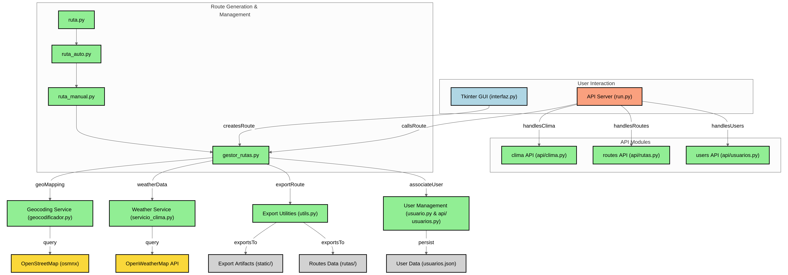

# Rutas turísticas en Alicante
## Autores

* (Coordinador) [Marcos Francés Requena](https://github.com/mfr73ua)
* [Rares Andrei Mocanu](https://github.com/ra-and5)
* [Marta López Martos](https://github.com/martalopez6)
* [Germán Hurtado Rodríguez](https://github.com/ghr8)
* [David González Fernández](https://github.com/Gallego-DavidGonzalez)

## Profesor
[Cristina Cachero](https://github.com/ccacheroc)

## Requisitos

Este proyecto consiste en una aplicación completa para la **creación, gestión, visualización y exportación de rutas geográficas** entre usuarios. Diseñado con un enfoque modular y extensible, el sistema ofrece una experiencia amigable al usuario gracias a su **interfaz gráfica construida con Tkinter**. Su funcionalidad se centra en generar rutas dentro de la ciudad de Alicante, aprovechando los datos de OpenStreetMap y la API de OpenWeatherMap para enriquecer la experiencia del usuario.

### 🧭 Estructura de archivos del sistema de rutas

A continuación se muestra la estructura del proyecto:

```
.
├── Ejecucion_local/  # Carpeta para ejecutar el proyecto en local
|   ├── ...
├── rutas/
|   ├── ...
├── static/
|   ├── ...
├── test/ # Tests para probar diferentes funcionalidades del proyecto
|   ├── ...
├── .gitignore
├── Direcciones_para_probar.txt
├── diagram.png
├── ejecutable_linux  # Ejecutable para SO Linux
├── geocodificador.py
├── gestor_rutas.py
├── interfaz.py
├── logo.png
├── main.py
├── miapp.py # Implementación de la API en pythonanywhere
├── migracion_db.py
├── Readme.md
├── requirements.txt
├── run.py
├── ruta_auto.py
├── ruta_manual.py
├── ruta.py
├── servicio_clima.py
├── usuario_db.py
├── usuarios.db
├── usuarios.json
└── utils.py
```

El corazón del sistema es la clase `Ruta`, encargada de representar una ruta geográfica con todos sus metadatos: coordenadas, distancia, duración estimada, dificultad, y puntos relevantes. Internamente, se utiliza la biblioteca `osmnx` para construir un **grafo urbano basado en la red vial** de la ciudad, lo que permite calcular caminos óptimos entre origen, puntos intermedios y destino.

Cada ruta generada se exporta automáticamente en cuatro formatos distintos:

- **HTML interactivo** con el mapa visual y marcadores (vía Folium).
- **Archivo GPX** compatible con dispositivos GPS.
- **Informe PDF** con detalles como tramos, distancias y tiempo estimado.
- **Imagen PNG** del mapa generado (usando Selenium para captura del HTML).

Además, se clasifica automáticamente cada ruta según su **nivel de dificultad** (bajo, medio, alto) dependiendo de la distancia, y se estima la duración en función del medio de transporte elegido: caminar, bicicleta o coche.

### 🛠️ Rutas manuales y automáticas

El sistema ofrece dos formas principales de crear rutas:

1. **Ruta Manual**: El usuario introduce el origen, puntos intermedios y destino de forma explícita, junto al modo de transporte y un nombre para la ruta. Esta opción brinda un control total sobre el recorrido y permite guardar la ruta directamente asociada al perfil del usuario.

2. **Ruta Automática**: A partir de una lista de direcciones dadas, el sistema genera múltiples rutas aleatorias entre pares de puntos, seleccionando también al azar los puntos intermedios y el medio de transporte. Esta funcionalidad es útil para descubrir nuevos recorridos de manera rápida y sin esfuerzo.

Todas las rutas creadas quedan almacenadas como archivos `.json` y se asocian al usuario correspondiente dentro de una base de datos persistente en `usuarios.db`.

### 👤 Gestión de usuarios y relaciones sociales

El sistema incluye un **módulo completo de autenticación** que permite a los usuarios registrarse, iniciar sesión y almacenar sus rutas. Los datos personales (nombre, email, ciudad, etc.) se guardan junto con una lista de rutas creadas y una lista de amigos.

La lógica de amistad se basa en la detección automática de **rutas compartidas**: si dos usuarios tienen al menos una ruta en común, se consideran amigos. La interfaz permite consultar las rutas en común con cada amigo y acceder a sus archivos exportados.

Cada usuario puede visualizar sus rutas guardadas, abrir el archivo PDF o HTML asociado directamente desde la interfaz, y consultar información básica como origen, destino, y modo de transporte.

### ☁️ Consulta meteorológica integrada

Una de las funcionalidades destacadas es la **consulta del clima** usando la API de OpenWeatherMap. El usuario puede introducir cualquier ciudad (por defecto, se espera que sea en España) y obtener información actualizada sobre:

- Temperatura
- Humedad
- Descripción del clima
- Velocidad del viento
- Fecha y hora de la medición

Esto permite planificar rutas de forma más informada, anticipando posibles condiciones meteorológicas adversas.

### 🧩 Modularidad y código organizado

El proyecto está dividido en módulos altamente cohesivos y con responsabilidades bien definidas:

- `ruta.py`, `ruta_auto.py`, `ruta_manual.py`: gestión de rutas.
- `utils.py`: funciones de exportación.
- `usuario_db.py`: clase para manejar usuarios.
- `gestor_rutas.py`: carga, filtrado y análisis de rutas.
- `geocodificador.py`: conversión de direcciones en coordenadas.
- `servicio_clima.py`: consulta del clima mediante API.
- `interfaz.py`: interfaz gráfica completa con menús y formularios.





## Instrucciones de instalación y ejecución

Para la ejecución del código recomendamos clonar el repositorio desde el siguiente comando:

   ```bash
   git clone https://github.com/mfr73ua/prog2-25-C3.git
   ```
A continuación recomendamos la creación de un venv:

   ```bash
   python3 -m venv <nombre_venv>
   ```
Activamos el venv:

   ```bash
   source <nombre_venv>/bin/activate
   ```
Para la instalación de las librerías necesarias para la ejecución del proyecto ejecute el siguiente comando dentro del repositorio (directorio) clonado:

   ```bash
   pip install -r requirements.txt
   ```

**Para la ejecución del proyecto en local basta con ejecutar el fichero `ejecutable_windows.exe` en un dispositivo con sistema operativo Windows o ejecutar `ejecutable_linux` en un dispositivo con sistema operativo Linux. A su vez se puede ejecutar en modo local ejecutando primero `run.py` para levantar la API y, a continuación, `main.py` para ejecutar la interfaz gráfica**

## Resumen de la API

Actualmente, el sistema cuenta con una API que permite procesar rutas desde el backend. Esta API está pensada como punto de entrada para automatizar la generación de rutas y obtener archivos exportados como GPX, PDF y HTML ligada a la interfaz gráfica.

[Enlace a nuestra API en `pythonanywhere`](https://ra55.pythonanywhere.com/)

### Autenticación

#### **Login**
- **Método**: `POST`
- **Endpoint**: `/api/login`
- **Parámetros**:
  - `username`: Nombre de usuario
  - `password`: Contraseña del usuario
- **Descripción**: Autentica al usuario y devuelve un mensaje de éxito con el nombre de usuario si las credenciales son correctas. Si son incorrectas, devuelve un error.

---

### Gestión de Usuarios 

#### **Registrar un usuario**
- **Método**: `POST`
- **Endpoint**: `/api/registro`
- **Parámetros**:
  - `nombre`, `apellido`, `email`, `username`, `telefono`, `fecha_nacimiento`, `ciudad`, `password`
- **Descripción**: Registra un nuevo usuario. Si el nombre de usuario ya existe, devuelve un error.

#### **Actualizar perfil de usuario**
- **Método**: `PUT`
- **Endpoint**: `/api/usuarios/<username>`
- **Parámetros (JSON)**:
  - `nombre`, `apellido`, `email`, `telefono`, `ciudad` (campos opcionales a actualizar)
- **Descripción**: Actualiza los datos personales del usuario. Devuelve un mensaje de éxito o error si no se encuentra.

#### **Eliminar usuario**
- **Método**: `DELETE`
- **Endpoint**: `/api/usuarios/<username>`
- **Parámetros**:
  - `username`: Nombre de usuario a eliminar
- **Descripción**: Elimina el usuario de la base de datos (`usuarios.json`). No afecta a otros usuarios ni a las rutas.

#### **Buscar usuarios**
- **Método**: `GET`
- **Endpoint**: `/api/usuarios/buscar`
- **Parámetros (query)**:
  - `nombre`: Cadena de texto a buscar en el `username`
- **Descripción**: Devuelve una lista de usernames que contienen el texto proporcionado.

#### **Eliminar una ruta de un usuario**
- **Método**: `DELETE`
- **Endpoint**: `/api/usuarios/<username>/rutas/<nombre_ruta>`
- **Descripción**: Elimina la ruta del usuario y sus archivos PDF/HTML/GPX asociados si existen.

#### **Obtener rutas de un usuario**
- **Método**: `GET`
- **Endpoint**: `/api/usuarios/<username>/rutas`
- **Parámetros**:
  - `username`: Nombre de usuario
- **Descripción**: Obtiene todas las rutas asociadas al usuario especificado. Si el usuario no existe, devuelve un error.

#### **Obtener rutas comunes entre dos usuarios**
- **Método**: `GET`
- **Endpoint**: `/api/usuarios/<username1>/rutas_comunes/<username2>`
- **Parámetros**:
  - `username1`: Nombre de usuario del primer usuario
  - `username2`: Nombre de usuario del segundo usuario
- **Descripción**: Obtiene las rutas comunes entre dos usuarios. Si alguno de los usuarios no existe, devuelve un error.

#### **Obtener amigos con los que se comparten rutas**
- **Método**: `GET`
- **Endpoint**: `/api/usuarios/<username>/amigos_comunes`
- **Parámetros**:
  - `username`: Nombre de usuario
- **Descripción**: Obtiene los amigos del usuario con los que comparte rutas, devolviendo las rutas comunes.

---

### Gestión de Rutas

#### **Crear ruta manual**
- **Método**: `POST`
- **Endpoint**: `/api/ruta_manual`
- **Parámetros**:
  - `origen`: Punto de origen de la ruta
  - `intermedios`: Puntos intermedios separados por comas
  - `destino`: Punto de destino de la ruta
  - `modo`: Modo de transporte (por ejemplo, "walk", "bike", "drive")
  - `nombre`: Nombre de la ruta (opcional)
  - `username`: Nombre de usuario del creador
  - `password`: Contraseña del creador
- **Descripción**: Crea una ruta manual y genera archivos PDF, GPX y HTML. Si la creación es exitosa, devuelve los archivos generados. Si ocurre un error, devuelve un mensaje de error.

#### **Crear rutas automáticas**
- **Método**: `POST`
- **Endpoint**: `/api/ruta_auto`
- **Parámetros**:
  - `direcciones`: Lista de direcciones separadas por comas
  - `cantidad`: Cantidad de rutas a generar
  - `username`: Nombre de usuario del creador
  - `password`: Contraseña del creador
- **Descripción**: Crea rutas automáticas basadas en las direcciones proporcionadas. Si la creación es exitosa, devuelve las rutas generadas. Si ocurre un error, devuelve un mensaje de error.

#### **Obtener rutas filtradas**
- **Método**: `GET`
- **Endpoint**: `/api/rutas`
- **Parámetros**:
  - `dificultad`: (opcional) Dificultad de la ruta (`bajo`, `medio`, `alto`)
  - `max_km`: (opcional) Distancia máxima en kilómetros
  - `max_horas`: (opcional) Duración máxima en horas
  - `transporte`: (opcional) Medio de transporte (`walk`, `bike`, `drive`)
- **Descripción**: Obtiene las rutas filtradas según los parámetros proporcionados (dificultad, distancia, duración, y medio de transporte).

---

### Descargas

#### **Descargar PDF de una ruta**
- **Método**: `GET`
- **Endpoint**: `/api/rutas/<nombre>/pdf`
- **Parámetros**:
  - `nombre`: Nombre de la ruta
- **Descripción**: Permite descargar el archivo PDF correspondiente a la ruta especificada.

#### **Descargar HTML de una ruta**
- **Método**: `GET`
- **Endpoint**: `/api/rutas/<nombre>/html`
- **Parámetros**:
  - `nombre`: Nombre de la ruta
- **Descripción**: Permite descargar el archivo HTML correspondiente a la ruta especificada.
